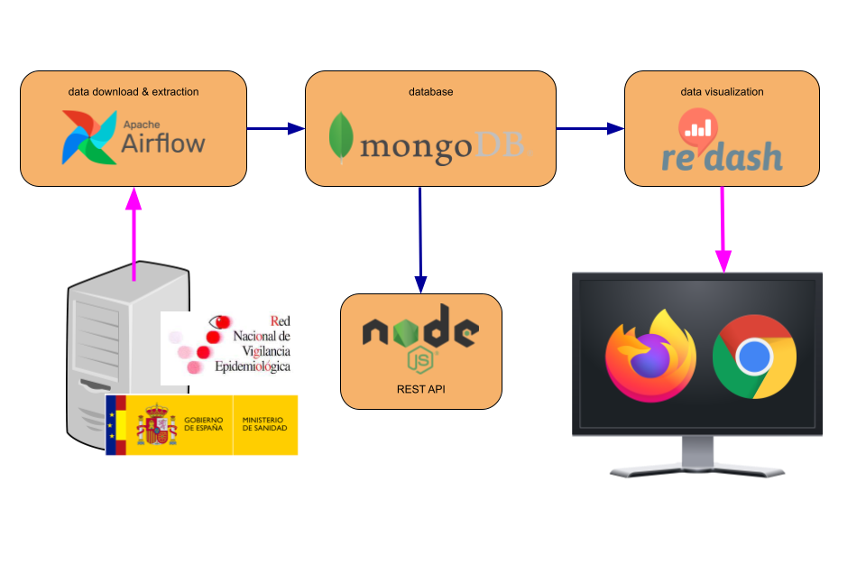
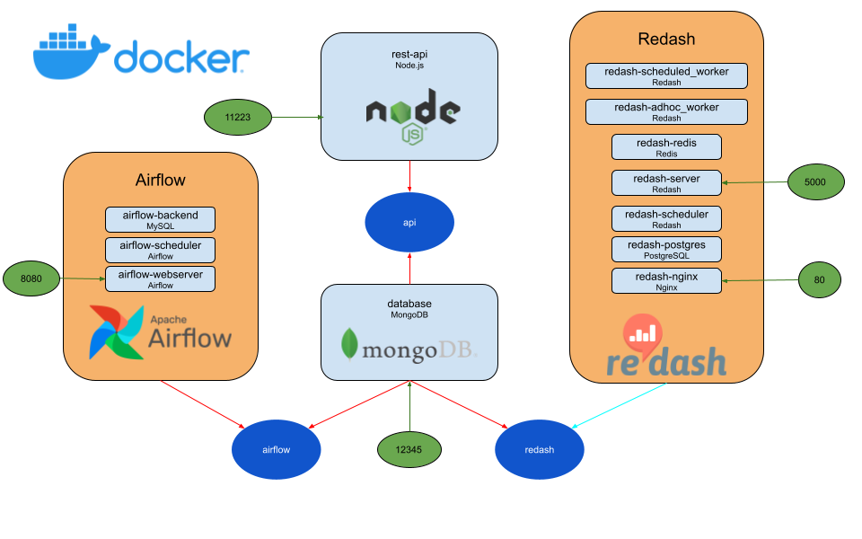
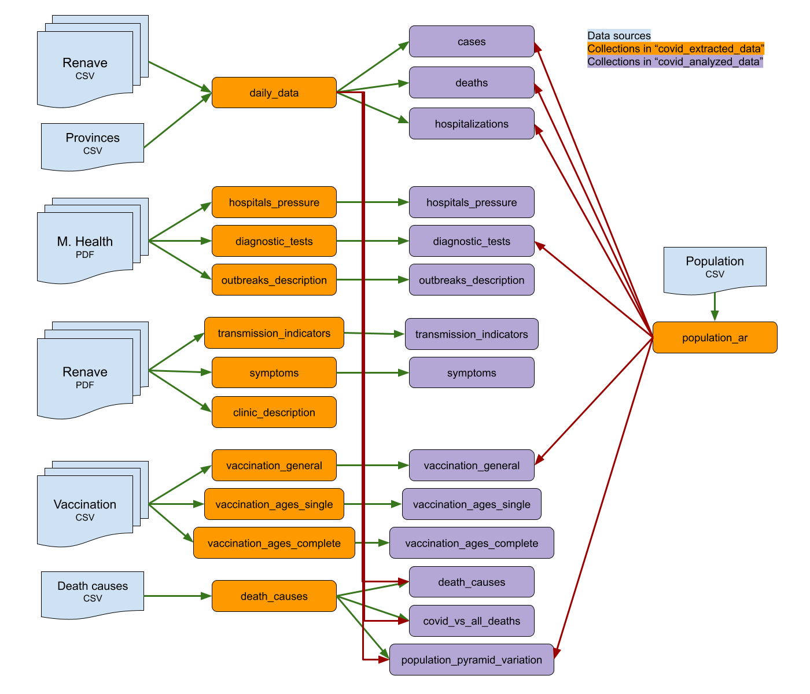
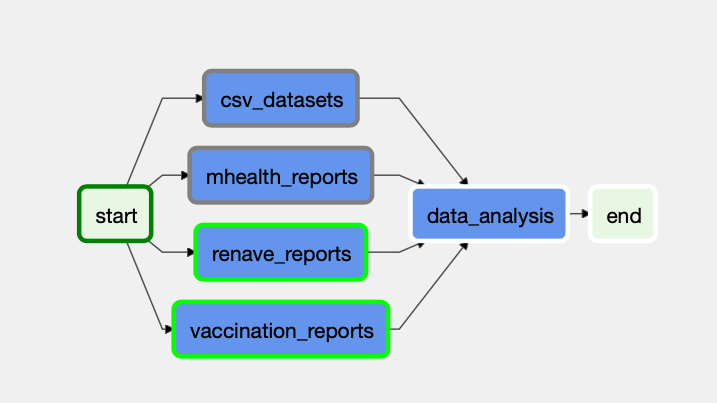
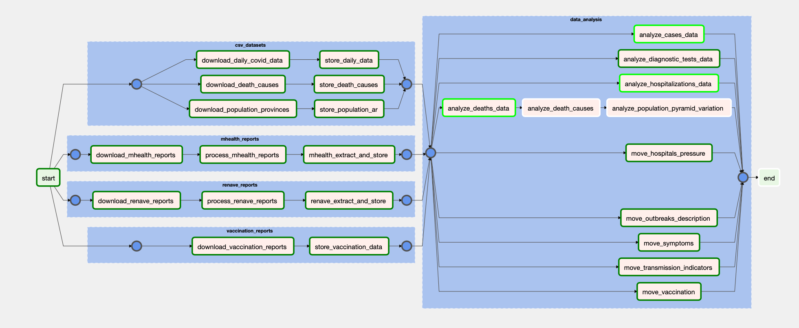
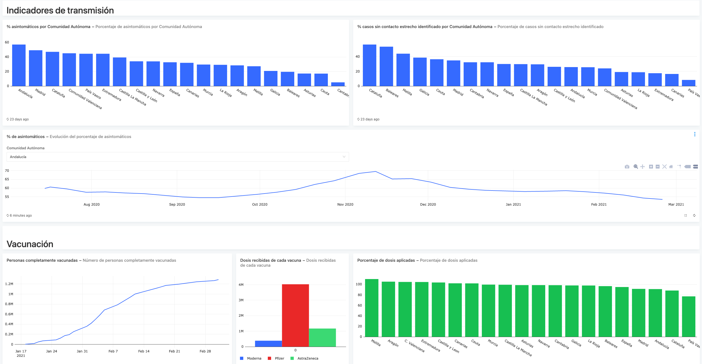

# Spanish COVID-19 Dashboard

This application provides a complete data pipeline to download, extract, analyze, store, and visualize data from different sources about the evolution of the COVID-19 pandemic in Spain. This document tries to explain all the technical details about how this app works.

## General overview

The main components of the application are:
- **ETL pipeline**: a daily-run workflow that downloads the data from several sources, processes it (in order to have a consistent format) and analyzes it (in order to extract new metrics) and stores it into a database. This pipeline is written in Python and orchestrated with [Apache Airflow](https://airflow.apache.org).
- **Database**: a [MongoDB](https://mongodb.com) database where all the extracted and processed data is stored, in order to be consumed by the the dashboard and the REST API.
- **REST API**: a HTTP server developed with [Node.js](https://nodejs.org) and [Express.js](https://expressjs.com) to retrieve the stored data from MongoDB.
- **Visualization dashboard**: a web dashboard with charts to visualize the data stored in the database. This dashboard has been created with [Redash](https://redash.io).

The whole application is deployed as a set of interconnected containers with [Docker Compose](https://docs.docker.com/compose/):

Each pale blue box represents a Docker container, each blue oval a Docker network, and each green oval a redirection of a host port to a container port. The deployment setup is automated, so in the first run, all the services know how to communicate and authenticate with each other. In the case of Airflow, the connection to the MongoDB database and the creation of an admin account are automated through the `docker/docker-compose.admin.yml` file, while in Redash, when the PostgreSQL image is created from the `docker/redash-database/Dockerfile`, a dump with a user and the complete dashboard is restored.

### File structure
- `docker-compose.yml`: definition of the deployment and orchestration of the Docker containers
- `covid_data`: folder where the downloaded data will be stored. Mapped as a Docker volume.
- `dags`: Python files defining the Airflow workflow. Mapped as a Docker volume.
- `docker`: files to create the custom Docker images for the containers of this application.

## ETL pipeline

### Data sources
- **[Ministry of Health](https://www.mscbs.gob.es/profesionales/saludPublica/ccayes/alertasActual/nCov/situacionActual.htm)**:
    - **PDF** report with the evolution of the pandemic in Spain, published daily from Monday to Friday. *[Example from 13th January 2021](https://www.mscbs.gob.es/profesionales/saludPublica/ccayes/alertasActual/nCov/documentos/Actualizacion_289_COVID-19.pdf)*.
        - **Diagnostic tests**
        - **Outbreaks description**
        - **Hospital pressure**
    - Daily vaccination reports in **ODS** format. *[Example from 10th February 2021](https://www.mscbs.gob.es/profesionales/saludPublica/ccayes/alertasActual/nCov/documentos/Informe_Comunicacion_20210210.ods)*.
- **[RENAVE](https://www.isciii.es/QueHacemos/Servicios/VigilanciaSaludPublicaRENAVE/EnfermedadesTransmisibles/Paginas/InformesCOVID-19.aspx)**:
    - [casos_hosp_uci_def_sexo_edad_provres.csv](https://cnecovid.isciii.es/covid19/resources/casos_hosp_uci_def_sexo_edad_provres.csv): daily updated **CSV** with the number of new cases, deaths, and hospitalizations, grouped by gender, age range and province.
    - **PDF** report with the epidemiological evolution, published weekly. *[Example from 29th December 2020](https://www.isciii.es/QueHacemos/Servicios/VigilanciaSaludPublicaRENAVE/EnfermedadesTransmisibles/Documents/INFORMES/Informes%20COVID-19/Informe%20COVID-19.%20Nº%2059_29%20de%20diciembre%20de%202020.pdf)*:
        - **Clinical description**: previous illnesses and symptoms.
        - **Transmission indicators**: asymptomatic patients percentage, identified contacts per case...
- **[INE (National Institute of Statistics)](http://ine.es)**:
    - **CSV** with the death causes in Spain in 2018: [link to the file](http://www.ine.es/jaxi/files/_px/es/csv_sc/t15/p417/a2018/01004.csv_sc)
    - **CSV** with the Spanish population by Autonomous Region, age range, and gender: [link to the file](https://www.ine.es/jaxiT3/files/t/es/csv_bdsc/9683.csv)
- **Self-made**:
    - **CSV** with Spanish provinces grouped by Autonomous Region: [link to the file](https://gist.githubusercontent.com/gbarreiro/7e5c5eb906e9160182f81b8ec868bf64/raw/8812c03a94edc69f77a6c94312e40a05b0c19583/provincias_espa%25C3%25B1a.csv)

### Apache Airflow workflow

Apache Airflow is the orchestrator of the data pipeline. This means that it will run everyday the workflow to download the data, process it and store it into the database. This pipeline is defined in the Python files in the `dags` folder. To enable or disable the workflow, monitor it, configure it or run it manually, you can log in at the Airflow web console in http://localhost:8080 with the username `admin` and the password `nonecesitocontrasenha`.

For each data source, a *TaskGroup* is defined:
- **csv_datasets**: Download and store all the data in CSV format. Defined in `dags/taskgroups/CSVDatasets.py`:
    - **download_daily_covid_data**: Download the latest `casos_hosp_uci_def_sexo_edad_provres.csv` as `covid_data/csv_data/daily_covid_data.csv`.
    - **store_daily_data**: Read the downloaded `daily_covid_data.csv`, extract the data and store it in the `covid_extracted_data` database.
    - **download_death_causes**: In case it hadn't been downloaded before, download the CSV with the 2018 death causes as `covid_data/csv_data/death_causes.csv`.
    - **store_death_causes**: Read the downloaded death causes CSV, extract the data and store it in the `covid_extracted_data` database.
    - **download_population_provinces**: In case it hadn't been downloaded before, download the CSVs with the Spanish population from INE and the Spanish provinces grouped by Autonomous Region as `covid_data/csv_data/population_ar.csv` and the CSV with the correspondance between Spanish provinces and Autonomous Regions as `covid_data/csv_data/provinces_ar.csv`.
    - **store_population_ar**: Read the downloaded CSVs, extract the data and store it in the `covid_extracted_data` database.
- **mhealth_reports**: Download all the PDF reports from Ministry of Health, extract the desired data and store it in the database. Defined in `dags/taskgroups/PDFMhealth.py`:
    - **download_mhealth_reports**: Download the new reports released since the latest execution of the workflow in the folder `covid_data/mhealth_reports`.
    - **process_mhealth_reports**: Read the PDF documents, convert them to raw text and create an index with the tables contained on each document.
    - **mhealth_extract_and_store**: Extract the data from the tables and store it into `covid_extracted_data`.
- **renave_reports**: Download all the PDF reports from RENAVE, extract the desired data and store it in the database. Defined in `dags/taskgroups/PDFRenave.py`:
    - **download_renave_reports**: Download the new reports released since the latest execution of the workflow in the folder `covid_data/renave_reports`.
    - **process_renave_reports**: Read the PDF documents, convert them to raw text and create an index with the tables contained on each document.
    - **renave_extract_and_store**: Extract the data from the tables and store it into `covid_extracted_data`.
- **vaccination_reports**: Download all the ODS daily vaccination reports, extract the data and store it in the database. Defined in `dags/taskgroups/VaccinationReports.py`:
    - **download_vaccination_reports**: Download the new reports released since the latest execution of the workflow in the folder `covid_data/vaccination_reports`.
    - **store_vaccination_data**: Extract the data from the ODS spreadsheets and store it into the `covid_extracted_data` database.
- **data_analysis**: Analyze and/or transform all the data stored in `covid_extracted_data` and store it in `covid_analyzed_data`:
    - **analyze_cases_data**: Read the daily COVID cases data from the `covid_extracted_data` database, calculate variables like the cases per population, 14 days CI, and new cases moving average, and store them in the `cases` collection of the `covid_analyzed_data` database.
    - **analyze_diagnostic_tests_data**: Read the diagnostic tests data from the `covid_extracted_data` database, calculate variables like the average positivity, number of total tests, and tests per population, and store them in the `diagnostic_tests` collection of the `covid_analyzed_data` database.
    - **analyze_hospitalizations_data**: Read the daily COVID hospitalizations data from the `covid_extracted_data` database, calculate variables like the number of hospitalizations per population, percentage of hospitalizations and more, and store them in the `hospitalizations` collection of the `covid_analyzed_data` database.
    - **analyze_deaths_data**: Read the daily COVID deaths data from the `covid_extracted_data` database, calculate variables like the deaths per population, mortality percentage, and new deaths moving average, and store them in the `deaths` collection of the `covid_analyzed_data` database.
    - **analyze_death_causes**: Read the death causes data from `covid_extracted_data`, pick the top 9, add the number of deaths caused by COVID, and store the results in the `top_death_causes` collection of the `covid_analyzed_data`. Then calculate the percentage of deaths corresponding to COVID, and store it in `covid_vs_all_deaths`.
    - **analyze_population_pyramid_variation**: Calculate the percentage of the population for each gender and age range who died of COVID, and store it in `population_pyramid_variation`.
    - **analyze_hospitals_pressure**: Read the hospitals pressure data from `covid_extracted_data`, calculate the data for the whole country and the moving averages for the variables, and store it in the collection `hospitals_pressure` in `covid_analyze_data`.
    - **move_outbreaks_description**: Just move the outbreaks description data from the `covid_extracted_data` database to `covid_analyzed_data`.
    - **move_symptoms**: Just move the symptoms data from the `covid_extracted_data` database to `covid_analyzed_data`.
    - **move_transmission_indicators**: Read the symptoms data from `covid_extracted_data`, aggregate it for the whole country and store it in the collection `transmission_indicators` in `covid_analyzed_data`.
    - **analyze_vaccination**: Read the vaccination data from `covid_extracted_data`, calculate the percentage of people vaccinated and the vaccination speed, and store it into `covid_analyzed_data`.

### Data processing
All the data extraction, processing, and analysis is coded in Python, using the following libraries:
- [PyPDF2](https://pypi.org/project/PyPDF2/): extract text from the PDF reports. 
- [BeautifulSoup4](https://pypi.org/project/beautifulsoup4/): scrap the RENAVE website to get the links to all the published reports.
- [Pandas](https://pypi.org/project/pandas/): standardization of the different datasets (have the same structure, column names...), transformations (rows into columns and viceversa, data filtering...), and analysis (calculation of new metrics).
- [pymongo](https://pypi.org/project/pymongo/): read and write from/into the MongoDB database.

## Data storage

### Datasets and reports
All the datasets used in this application are downloaded in the `covid_data` folder of the Airflow container, which is mapped as a Docker volume to the host filesystem.

### MongoDB database
There are two databases in MongoDB: `covid_extracted_data`, for the "raw" data, and `covid_analyzed_data`, for the processed data. The Airflow workflow will write the extracted data in the first database, and then read from it, process the extracted data, and store it into `covid_analyzed_data`. However, the Redash dashboard and the REST API will only read data from `covid_analyzed_data`. For this reason, there are two users in the database, one for each service:
- **Airflow**: 
    - User: *airflow_user*
    - Password: *contrasenha123*
    - Permissions: read and write in both databases
- **Redash and REST API**:
    - User: *data_read*
    - Password: *givemesomedata*
    - Permissions: read on `covid_analyzed_data`

On each database the following collections are created:
- **covid_extracted_data**:
    - **daily_data**: Daily cases, hospitalizations and deaths grouped by day, Autonomous Region, gender, and age range.
    - **hospitals_pressure**: Hospital pressure grouped by day and Autonomous Region
    - **diagnostic_tests**: Number of diagnostic tests grouped by day and Autonomous Region
    - **death_causes**: All deaths in Spain in 2018 classified by gender, age range and cause.
    - **symptoms**: Most common symptoms, grouped by date (latest data from 29th May 2020)
    - **transmission_indicators**: Percentage asymptomatic cases, days until diagnostic, number of close contacts per case and cases without a known close contact, grouped by Autonomous Region.
    - **outbreaks_description**: Number of spreads and cases grouped by date and scope.
    - **clinic_description**: Common symptoms and data about previous chronic illnesses.
    - **vaccination_general**: General vaccination data, by Autonomous Region.
    - **vaccination_ages_single**: Percentage of population which has received, at least, one vaccination shot, grouped by Autonomous Region and age range.
    - **vaccination_ages_complete**: Percentage of population which has been completely vaccinated, grouped by Autonomous Region and age range.
    - **population_ar**: Spanish population grouped by Autonomous Region, gender, and age range.

- **covid_analyzed_data**:
    - **cases**: Absolut and relative number of new and total cases, CI, moving average... by date, gender, age range and Autonomous Region.
    - **deaths**: Absolut and relative number of new and total deaths, mortality ratiio, moving average... by date, gender, age range and Autonomous Region.
    - **hospitalizations**: Absolut and relative number of new and total hospitalizations, hospitalization ratio, moving average... by date, gender, age range and Autonomous Region.
    - **top_death_causes**: Number of deaths in Spain in 2018 for the top 10 death causes, grouped by gender and age range.
    - **covid_vs_all_deaths**: Percentage of deaths in a "normal year" which would correspond to COVID.
    - **population_pyramid_variation**: Variation of the population pyramid after the deaths caused by COVID.
    - **diagnostic_tests**: Absolut and relative number of new and total diagnostic tests, positivity ratio... by date and Autonomous Region.
    - **vaccination_general**: Daily vaccination data for each Autonomous Region: number of vaccines received and applied, percentage of people who received one dose...
    - **vaccination_ages_single**: Percentage of population which received, at least, one dose, grouped by Autonomous Region and age range.
    - **vaccination_ages_complete**: Percentage of population which has been completely vaccinated, grouped by Autonomous Region and age range.
    - **symptoms**: More common symptoms and its percentage among symptomatic patients.
    - **hospitals_pressure**: Hospitals pressure by date and Autonomous Region, in absolut and relative terms.
    - **outbreaks_description**: Number of spreads and cases classified by date and scope.
    - **transmission_indicators**: Miscellanious data by Autonomous Region: Percentage of asymptomatic cases, number of close contacts identified by case...

## Access to the processed data
This application provides two interfaces to access the analyzed data: a REST API and a web dashboard.

### REST API
The REST API consists in a web server built with Node.js and Express.js, which connects to the `covid_analyzed_data` database in MongoDB. The Node application can be found in `docker/rest-api/node`: in the `app.js` file (the entrypoint of the application), the connection to the database is established and the routes defined in `routes/routes.js` are imported. Each GET request defined in `routes/routes.js` corresponds to each of the database collections, whose contents are returned in the response body.

Notice how some auxiliar methods are defined in `routes.js`: 
- `logRequest()`: Logs in the console each received HTTP request
- `getQueryFilters()`: Allows the client to filter the query by one or several fields
- `projectColumns()`: Allows the client to choose to receive only a set of given fields for a query
- `limitQuerySize()`: Allows the client to paginate the response

Besides, [an OpenAPI document](covid-api.yaml) has been created to describe the REST API.

### Data visualization

The processed data can be visualized in a web dashboard made with Redash. For this purpose, a dashboard has been already created, with different types of charts to visualize the data contained in the database. This dashboard can be publicly accessed through the URL http://localhost/public/dashboards/3JJKFpOF7Fx5ES73vnFFRbTx5VoiqEx4ZP2rL895. To edit the dashboard or create new queries, you must log in into the Redash console at http://localhost with the username `covid_dashboard@noreply.com` and the password `nonecesitocontrasenha`.

## Deployment

Initial setup:

`docker-compose build`

`docker-compose -f docker-compose.yml -f docker/docker-compose.admin.yml run --rm airflow-initializer`

`docker-compose stop`

- Basic launch (database + REST API server): `docker-compose up -d`
- Basic launch + Airflow: `docker-compose --profile airflow up -d`
- Basic launch + Redash: `docker-compose --profile redash up -d`
- Basic launch + Airflow + Redash: `docker-compose --profile redash --profile airflow up -d`